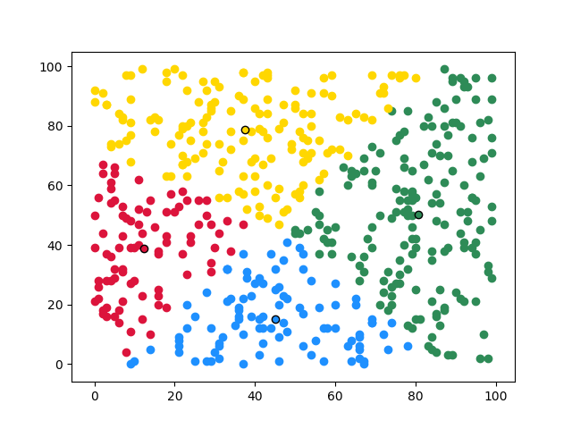
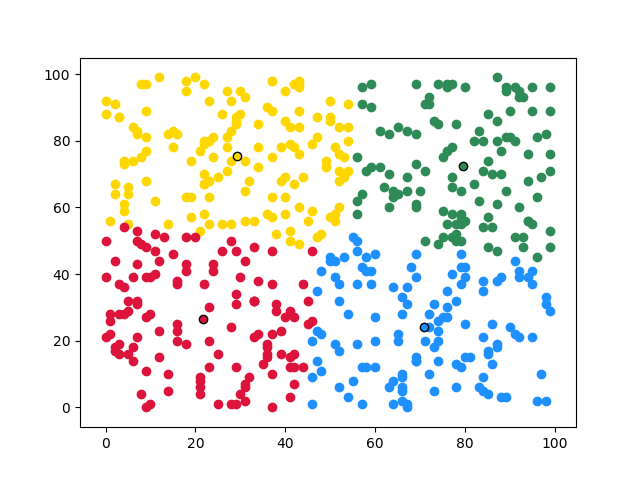
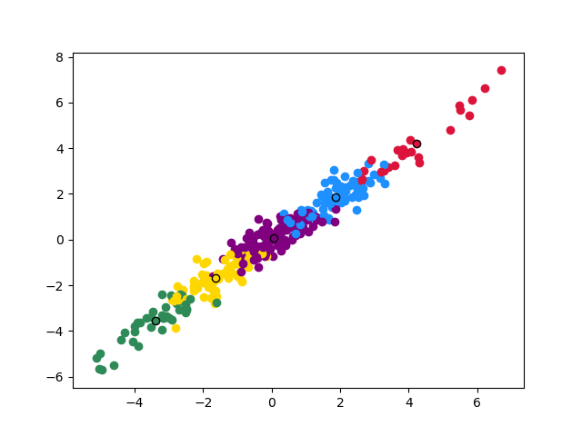
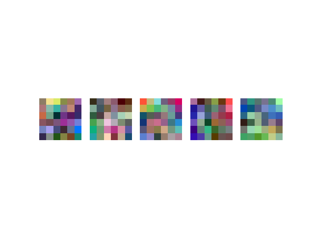
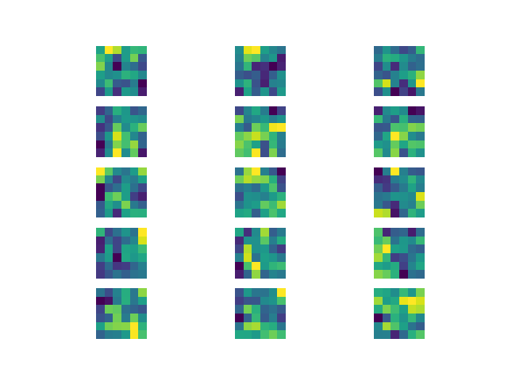

# Toy Kmeans

Python(numpy)で実装した。

kmeansの実装は`src/lib/kmeans.py`を参照。  
回数を指定して、回数だけクラスタ代表点(centroids)を更新するように実装した。

実際に動かして挙動を確認するために、デモコードを用意した。

---

## デモ①

```
python src/demo_basic.py
```

4つのクラスタに分けられる。 (k=4とした)

黒枠の丸はクラスタの代表点を表している。

<table>
  <tr>
    <th>5回目</th>
    <th>10回目</th>
  </tr>
  <tr>
    <td></td>
    <td></td>
  </tr>
  <tr>
    <th>20回目</th>
    <th>50回目</th>
  </tr>
  <tr>
    <td></td>
    <td></td>
  </tr>
</table>

20回目と50回目を比べると変化がない。
ただし、データによっては収束する回数は異なるので注意。

---

## デモ②

[*An Analysis of Single-Layer Networks in Unsupervised Feature Learning*](http://proceedings.mlr.press/v15/coates11a.html)で行われている、画像から小サイズのパッチを切り出して、それらをkmeansクラスタリングをすることを、ここでデモしてみる。
論文中では、CIFAR-10のデータセットを利用して、特徴抽出からSVMによる識別までを行っているが、ここでは行わない。

ここでは自身で作成したkmeansコードを試すだけなので、CIFAR-10の全データを使うことはせず、CIFAR-10の[Webサイト](https://www.cs.toronto.edu/~kriz/cifar.html)上に掲載されているサンプル画像を利用した。
これをnumpy配列にして保存したものをリポジトリに含める。
これを`dataset/mini-cifar10.npy`とする。ラベル情報は、ここでは不要なため含めない。

クラスタリングした結果をプロットしてみた。(プロットしたからと言って、特別に何かするわけでもないですが)

```
python src/demo_rep.py
```

* 画像枚数： 100
* パッチ合計枚数： 300 (各画像から3枚のパッチを切り出した)
* パッチサイズ： 6 x 6
* クラスタ数： 5
* 前処理： ZCA whitening

<table>
  <tr>
    <th>プロット</th>
    <th>クラスタの内容</th>
    <th>クラスタの各チャンネルの内容</th>
  </tr>
  <tr>
    <td></td>
    <td></td>
    <td></td>
  </tr>
</table>

特に意味はないが、各チャンネルの内容も出してみた。

縦にクラスタごと、横にRGBの順である。

